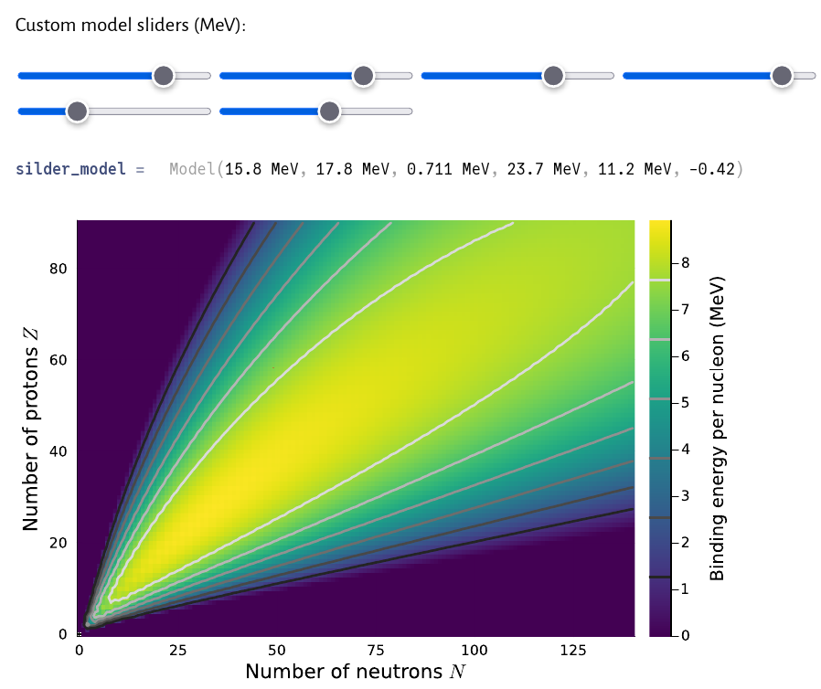

# Analyzing the Semi-Empirical Mass Formula
Julia and Python notebooks analyzing the semi-empirical mass formula (SEMF) and
comparing its binding energy predictions to experimental data. This work was a
research project done under the supervision of Dr. Jason Donev from November 2022 to 
April 2023.

The Python notebook contains most of the analytical comparisons, while the Julia
notebook contains the interactive model.

The main attraction is indeed this interactive model which is seen below.

## Todo List
- [ ] Either figure out how [Binder](https://github.com/fonsp/pluto-on-binder) works with Pluto notebooks, or perhaps translate the
interactive model to Javascript so the model can be hosted on a website. Binder is probably the easier option.

